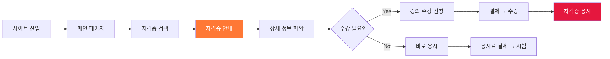
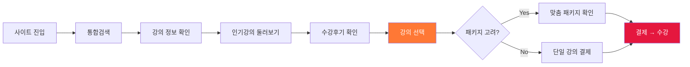
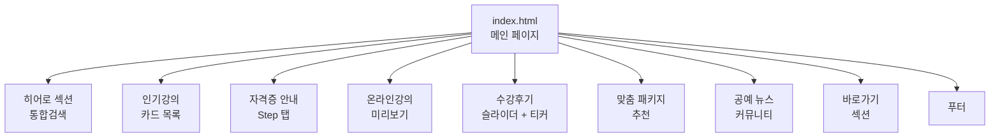
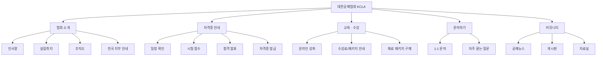

# 🪡 대한공예협회 (KCLA) Website Redesign

기존 대한공예협회 웹사이트를 전면 리디자인하여  
**사용자가 더 쉽고 빠르게 자격증 정보를 탐색하고 강의를 수강 신청할 수 있도록 개선한 웹 퍼블리싱 프로젝트**입니다.

> 공예인과 일반 대중 모두가 쉽게 이용할 수 있는 플랫폼을 목표로,  
> 50대 이상 주요 타겟층을 고려한 가독성 높은 UI와 직관적인 UX를 구현하였습니다.

---

# 프로젝트 링크

| 구분 | 링크 |
|---|---|
| GitHub | https://github.com/yujj9705/redesign-project |
| Notion 기획 문서 | https://bolder-shingle-eec.notion.site/35f65522b1d880b09186ddbec8ff8ee4?source=copy_link |

---

# 프로젝트 개요

| 항목 | 내용 |
|---|---|
| 프로젝트명 | 대한공예협회 (KCLA) Website Redesign |
| 유형 | 협회 웹사이트 UI/UX 리디자인 및 퍼블리싱 |
| 핵심 목표 | 한 눈에 보기 쉽고 탐색이 용이한 웹사이트 구축 |
| 주요 기능 | 자격증 안내, 온라인 강의 미리보기, 맞춤 패키지 추천, 수강 후기 |
| 제작 방식 | HTML, CSS, JavaScript |
| 디자인 툴 | Figma |
| 타겟 | 자격증 취득 목적 사용자 / 공예 강의 수강 목적 사용자 |

---

# 문제 정의

| 문제 | 내용 |
|---|---|
| 가독성 저하 | 정보 과다 배치로 인한 시각적 복잡함 |
| 시각적 피로 | 색상 과다 사용으로 인한 집중도 저하 |
| 접근성 미흡 | 사용자 목적별 탐색 흐름 부재 |

---

# 프로젝트 목표

- 한 눈에 보기 쉽고 탐색이 용이한 웹사이트 구축
- 공예인과 일반 대중 모두가 쉽게 이용할 수 있는 플랫폼 제공
- 사용자 목적(자격증 / 강의 수강)에 따른 명확한 흐름 설계

---

# User Persona

### Persona A — 자격증 취득 목적

> 30대 남성 / 공예 공방 오픈 예정, 전문성 어필을 위한 자격증 취득 및 창업 정보 탐색

| Needs | 내용 |
|---|---|
| 자격증 정보 | 한 눈에 보이는 자격증 정보 제공 |
| 비용/기간 | 비용 및 기간 안내 명확화 |
| 커뮤니티 | 실제 창업 사례가 있는 커뮤니티 |

---

### Persona B — 공예 강의 수강 목적

> 50대 여성 / 노년 취미 생활로 공예를 배우고 싶어 사이트 방문

| Needs | 내용 |
|---|---|
| 정보 안내 | 명확하고 간결한 정보 제공 |
| 구조 | 복잡하지 않은 탐색 구조 |
| 강의 탐색 | 직관적인 강의 탐색 및 미리보기 |

---

# User Flow

### Persona A (자격증)



### Persona B (취미 강의 수강)



---

# 레이아웃 설계 의도

| 섹션 | 배치 의도 |
|---|---|
| 인기강의 | 온라인 강의 주력 + 강의 종류가 많아 최상단 배치, 사용자가 가장 궁금해할 정보를 빠르게 파악 |
| 자격증 안내 | 협회의 중요 목적 중 하나로 상단 배치, 강의 다음으로 자격증 정보를 빠르게 파악하고 상세로 이동 가능 |
| 강의 미리보기 | 커리큘럼 / 필요 재료 / 최종 결과물 제공으로 사용자가 빠르고 효율적으로 강의 선택 |
| 수강후기 | 강의 미리보기와 함께 제공하여 신뢰도 강화 |
| 맞춤 패키지 추천 | 강의 목록 / 가격 / 할인율 안내로 사용자의 효율적인 선택 지원 |
| 공예 뉴스 | 짧은 뉴스 및 업데이트 소식을 빠르게 파악 가능 |

---

# 화면 구조



---

# 정보 구조도 (IA)



---

# UX 개선 방향

| 기존 문제 | 개선 방향 |
|---|---|
| 정보 과다로 가독성 저하 | 중요도 기준으로 정보 덜어내기, 주요 기능만 메인 배치 |
| 복잡한 자격증 신청 흐름 | Step 탭으로 단계별 시각화 |
| 강의 정보 탐색 불편 | 미리보기 패널로 즉시 확인 |
| 획일적인 카드 레이아웃 | 목적별 맞춤 패키지 추천 분리 |
| 고령 사용자 가독성 부족 | 최소 폰트 14px 이상 유지 |
| 모바일 탐색 불편 | 햄버거 메뉴 및 터치 최적화 |

---

# 반응형 브레이크포인트

| 구분 | 너비 | 주요 변경사항 |
|---|---|---|
| Desktop Large | 1920px | 기본 레이아웃 |
| Desktop Small | 1024px ~ 1200px | 패딩 축소, 폰트 조정 |
| Tablet | 768px ~ 1023px | 2열 카드, 세로 배치 |
| Mobile | ~ 767px | 1열 카드, 햄버거 메뉴 |
| Small Mobile | ~ 375px | 320px 최소 대응 |

---

# 디자인 방향

| 구분 | 내용 |
|---|---|
| KEYWORD | Accessible / Warm / Trustworthy |
| COLOR | 오렌지(#ff7835) + 레드(#e5173e) 포인트 컬러 |
| UI | 카드형 UI 및 Step 기반 정보 구조 |
| UX | 50대 타겟 대비 고가독성 및 직관적 흐름 |
| RESPONSIVE | 320px ~ 1920px 전 구간 반응형 |

---

# 기술 스택

### Frontend


### Library


### Tools


---

# 주요 구현 포인트

| 구분 | 구현 내용 |
|---|---|
| 히어로 슬라이더 | 흑백/컬러 좌우 Swiper 연동 |
| 자격증 탭 | Step 클릭 시 패널 전환 |
| 강의 미리보기 | 강의 선택 시 상세 패널 동적 업데이트 |
| 수강후기 티커 | 세로 무한 자동 스크롤 |
| 배너 | 오늘 그만보기 localStorage 저장 |
| 모바일 메뉴 | 햄버거 버튼 드로어 메뉴 |
| 반응형 | 320px ~ 1920px 전 구간 대응 |

---

# 폴더 구조

```text
redesign-project
├── assets
│   ├── images
│   └── icons
├── css
│   ├── style.css
│   ├── responsive.css
│   └── fonts.css
├── js
│   └── script.js
└── index.html
```

---

# 회고

### 아쉬웠던 점

| 항목 | 내용 | 개선 방향 |
|---|---|---|
| 취업/창업/부업 카테고리 | 협회가 밀고 있는 취업/창업/부업 부분을 충분히 보여주지 못함 | 디자인 수정 시 해당 카테고리 추가 |
| 메인 정보 과다 | 메인에 너무 많은 내용이 들어감 | 주요 기능만 메인에, 나머지는 링크 연결로 분리 |
| 컬러 사용 절제 | 주황 컬러 과도한 사용으로 시각적 피로도 발생 가능 | 포인트/강조 부분에만 사용, 배경은 차분한 컬러로 대체 |

### 어려웠던 점

| 항목 | 내용 |
|---|---|
| 정보 덜어내기 | 협회 성격상 안내해야 할 정보가 많아 중요도 기준을 잡고 덜어내는 것이 어려웠음 |
| 컬러 배치 | 협회 CI 컬러 조합의 세련미 부족으로 색감 배치에 어려움을 느낌 |
| 절제 | 기존에도 덜어내는 것을 잘 못하는 편이라 메인 과다 구성이 반복됨 |

---

# 프로젝트 의의

이 프로젝트는 단순한 웹사이트 리디자인이 아닌,  
**사용자 목적(자격증 취득 / 강의 수강)에 따른 명확한 흐름을 설계하고 접근성과 가독성을 개선한 UX 리디자인 프로젝트**입니다.

User Persona 분석을 통해 사용자의 목적별 흐름을 파악하고,  
각 섹션의 배치 의도를 명확히 하여 사용자가 원하는 정보에 빠르게 도달할 수 있도록 설계하였습니다.

---

# 제작자

| 구분 | 내용 |
|---|---|
| GitHub | https://github.com/yujj9705 |
